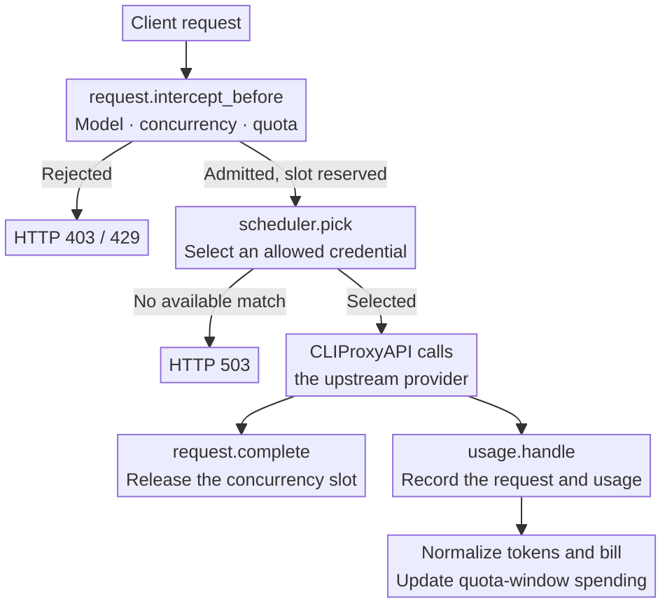
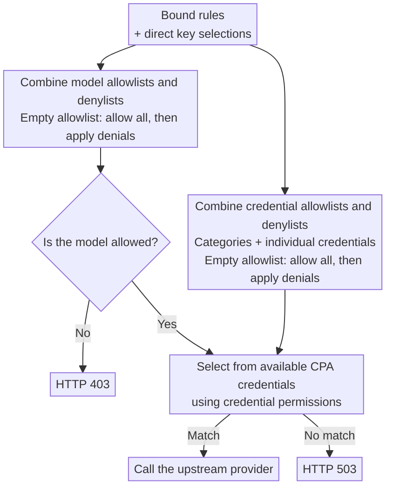

<div align="center">
  <h1>CPA Key Billing</h1>
  <p><strong>Per-key billing, subscription quotas, and routing for <a href="https://github.com/router-for-me/CLIProxyAPI">CLIProxyAPI</a>.</strong></p>
  <p>
    <a href="https://github.com/haowang02/cpa-plugin-key-billing/releases/latest"></a>
    <a href="https://github.com/haowang02/cpa-plugin-key-billing/actions/workflows/check.yml"></a>
    
    <a href="./LICENSE"></a>
  </p>
  <p><strong>English</strong> · <a href="./README.md">简体中文</a></p>
</div>


## Features

- Set spending, token, and request quotas for each API key, with independent or shared reset schedules.
- Apply separate rates to requests that exceed a long-context input threshold.
- Limit concurrent requests per API key.
- Control access to models and upstream credentials with routing rules.
- Use model reference prices from [models.dev](https://models.dev/), with optional custom overrides.

## How it works

Before a request reaches an upstream provider, the plugin checks subscription quotas, concurrency, and routing. After execution, CLIProxyAPI supplies usage through `usage.handle`. The plugin uses that record to store the request event, calculate its cost, and update spending for the current quota window.



## Requirements

- CLIProxyAPI **7.2.143 or later**.
- A CLIProxyAPI build with plugin support. Builds labeled `no-plugin` cannot load this plugin.

## Installation

Run the installer from your CLIProxyAPI directory.

On macOS or Linux:

```sh
curl -LsSf https://raw.githubusercontent.com/haowang02/cpa-plugin-key-billing/main/install.sh | sh
```

On Windows, stop CLIProxyAPI first, then run this in PowerShell:

```powershell
irm https://raw.githubusercontent.com/haowang02/cpa-plugin-key-billing/main/install.ps1 | iex
```

The installer places the plugin in `plugins/` under the current directory. Restart CLIProxyAPI after installing or upgrading.

For manual installation, download the archive for your platform from [Releases](https://github.com/haowang02/cpa-plugin-key-billing/releases/latest), then extract the library into CLIProxyAPI’s `plugins/` directory:

```text
plugins/cpa-key-billing.so       # Linux
plugins/cpa-key-billing.dylib    # macOS
plugins/cpa-key-billing.dll      # Windows
```

## Configuration

Add the following to your CLIProxyAPI configuration:

```yaml
plugins:
  enabled: true
  dir: "plugins"
  configs:
    cpa-key-billing:
      enabled: true
      debug: false # Include routing and reference-price matching in debug logs
      codex_fast_mode_billing: false # Charge 2.5× for Codex priority requests
      state_file: "plugins/cpa-key-billing-state-v1.db"
```

When `codex_fast_mode_billing` is enabled, requests to the Codex upstream with `service_tier=priority` are billed at **2.5 times** the standard cost.

> [!WARNING]
> Back up your data file before upgrading.
>
> - Databases created by v1.0.0 or later are migrated automatically.
> - JSON and SQLite files from v0.8.4 or earlier cannot be migrated. Point `state_file` to a new file instead.

Restart CLIProxyAPI and open **API Key Billing** in the management panel. Review model pricing, create subscription plans, and bind the API keys whose quotas you want to enforce.

## Access

Administrators can open the plugin from the management panel or visit it directly:

```text
http(s)://<CLIProxyAPI address>/v0/resource/plugins/cpa-key-billing/ui
```

API key holders can use their own key to view their subscription and usage:

```text
http(s)://<CLIProxyAPI address>/v0/resource/plugins/cpa-key-billing/ui#account
```

## Billing and quotas

- Keys without a subscription plan still have their usage recorded, but have no subscription quota limit.
- A plan can contain multiple quota windows. Each window can limit spending in USD, tokens, requests, or any combination of the three.
- Usage is tracked separately for each key, even when keys share a plan. Independent cycles start when the first request is admitted. Shared cycles use the configured schedule for every bound key.
- A manual quota reset keeps shared reset times unchanged. Independent cycles restart when the next request is admitted.
- Temporary credits can be set, adjusted, or revoked for one key and quota window without resetting usage or changing the plan. They are cleared when the cycle expires or is reset.
- Custom model prices take precedence over models.dev reference prices. Requests are rejected if neither is available.
- Request events are retained for 365 days.

## Routing rules

Bind routing rules on the API key page, or set model and credential permissions directly on a key. Each selection cycles through three states: unselected, allowed (check mark), and denied (cross).

A credential-category selection covers all credentials in that category, including credentials added later. You can deny individual credentials within an allowed category.

The plugin combines all bound rules with the key’s direct selections. Model and credential permissions are evaluated separately: allowlists are combined, denylists are combined, and denials take precedence. An empty allowlist permits everything that is not explicitly denied.



## Rejection responses

| Condition | HTTP status | `type` | `code` |
| --- | --- | --- | --- |
| Concurrency limit reached | `429` | `rate_limit_error` | `rate_limit_exceeded` |
| Subscription quota exhausted | `429` | `rate_limit_error` | `rate_limit_exceeded` |
| Model access denied | `403` | `permission_error` | `insufficient_quota` |
| No available credential matches the routing rules | `503` | `server_error` | `internal_server_error` |
| A bound routing rule is missing or invalid | `503` | `server_error` | `routing_configuration_error` |
| Model has no price | `503` | `cpa_key_billing_error` | `model_price_error` |

## Acknowledgments

- [LINUX DO](https://linux.do/) community.
