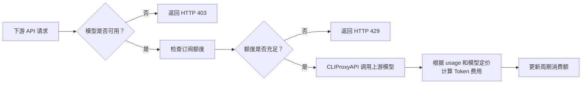

<div align="center">
  <h1>cpa-plugin-key-billing</h1>
  <p><strong><a href="https://github.com/router-for-me/CLIProxyAPI">CLIProxyAPI</a> 下游 API Key 计费与订阅额度插件。</strong></p>
  <p>
    <a href="https://github.com/haowang02/cpa-plugin-key-billing/releases/latest"></a>
    <a href="https://github.com/haowang02/cpa-plugin-key-billing/actions/workflows/check.yml"></a>
    
    <a href="./LICENSE"></a>
  </p>
</div>

<table>
  <tr>
    <td width="50%"></td>
    <td width="50%"></td>
  </tr>
  <tr>
    <td width="50%"></td>
    <td width="50%"></td>
  </tr>
</table>

## 功能特性

- 支持定期重置额度，每个 API Key 独立计时
- 支持按输入 Token 阈值切换长上下文**阶梯计价**
- 支持限制每个 API Key **可用的模型**，可直接选择模型，也可复用模型分组
- 可从 [models.dev](https://models.dev/) 获取模型参考价，不用挨个设置模型定价

## 工作原理

插件在请求进入时识别下游 API Key，检查它是否可以使用本次请求的模型，再检查订阅额度。请求结束后，插件按上游返回的真实 usage 和模型定价计算费用，并更新对应 API Key 的周期消费额。



## 环境要求

- CLIProxyAPI `7.2.103` 或更高版本，建议使用最新版本
- 使用支持插件的 CLIProxyAPI 构建，不要使用 `no-plugin` 版本

## 安装

在 CLIProxyAPI 根目录运行：

```sh
curl -LsSf https://raw.githubusercontent.com/haowang02/cpa-plugin-key-billing/main/install.sh | sh
```

安装脚本会识别操作系统和处理器架构，并将插件安装到 `plugins/` 目录。安装完成后需要重启 CLIProxyAPI。

也可以从 [Releases](../../releases/latest) 下载对应平台的发布包，解压后将动态库放入 CLIProxyAPI 的 `plugins/` 目录：

```text
plugins/cpa-key-billing.so       # Linux
plugins/cpa-key-billing.dylib    # macOS（二选一）
```

## 配置

在 CLIProxyAPI 配置文件中加入：

```yaml
plugins:
  enabled: true
  dir: "plugins"
  configs:
    cpa-key-billing:
      enabled: true
      state_file: "plugins/cpa-key-billing-state.db"
```

- `enabled`：启用计费和订阅额度控制
- `state_file`：计费数据库文件路径

插件使用 SQLite 持久化计费数据。从旧版本升级时无需修改配置：仍指向 `.json` 的 `state_file` 会自动解析为同目录下的同名 `.db`，并在首次启动时导入原有数据，导入后原 JSON 文件不再使用。

重启 CLIProxyAPI 后，在管理中心打开「API Key 计费」。确认模型定价后，创建订阅计划并绑定需要限制的 API Key。

## 计费与订阅规则

- 未绑定订阅计划的 API Key 只统计用量，不限制额度。
- 未定价模型按 `0 USD` 记录，并在计费日志中标记。
- 请求失败时，插件日志记录所属 API Key、请求路径、模型、上游凭据，以及客户端收到的错误内容；客户端没有收到任何响应体时（例如上游 WebSocket 直接关闭连接），改为记录 CLIProxyAPI 报告的 HTTP 状态码和错误内容。上游直接拒绝、没有产生任何用量的请求不进入计费日志，插件日志是其唯一记录。
- 计费日志和插件日志均保留最近 30 天；插件日志中的请求记录另外最多保留 500 条，超出后先淘汰最旧的请求记录，不影响运行事件。
- 每个 API Key 在首次使用时独立启动周期。周期到期后回到未开始状态，并在下一次使用时开启新周期。
- 达到订阅额度后，后续请求返回 HTTP `429`，并在插件日志中记录一次；同一周期内的后续拦截不再重复记录。

## 后续计划

- [ ] 增加用量与费用分析能力，帮助了解 API Key 的使用情况和消费趋势。

## 致谢

- [LINUX DO](https://linux.do/)——面向创造者与好奇者的社区
