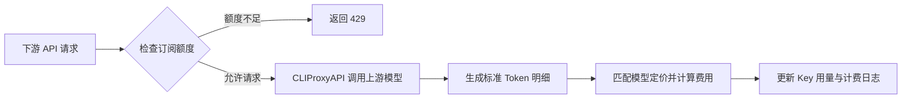

# cpa-key-billing

[CLIProxyAPI](https://github.com/router-for-me/CLIProxyAPI) 下游 API Key 计费与订阅额度插件。

## 功能特性

- 支持周期性重置订阅额度，每个 API Key 独立计时
- 支持按输入 Token 阈值切换长上下文**阶梯计价**
- 可从 [models.dev](https://models.dev/) 获取模型参考价，不用挨个设置模型定价

## 工作原理

插件在请求进入时识别下游 API Key 并检查订阅额度。CLIProxyAPI 完成上游调用后，会在响应格式转换前生成统一的 Token 明细；插件根据模型定价计算费用，再更新该 Key 的累计用量、当前周期和计费日志。



## 环境要求

- CLIProxyAPI `v7.2.97` 或更高版本，建议使用最新版本
- 使用支持插件的 CLIProxyAPI 构建，不要使用 `no-plugin` 版本

## 安装

在 CLIProxyAPI 根目录运行：

```sh
curl -LsSf https://raw.githubusercontent.com/haowang02/cpa-plugin-key-billing/main/install.sh | sh
```

安装脚本会识别操作系统和处理器架构，并将插件安装到 `plugins/` 目录。安装完成后需要重启 CLIProxyAPI。

也可以从 [Releases](../../releases/latest) 下载对应平台的发布包，解压后将动态库放入 CLIProxyAPI 的 `plugins/` 目录：

```text
plugins/cpa-key-billing.so       # Linux
plugins/cpa-key-billing.dylib    # macOS（二选一）
```

## 配置

在 CLIProxyAPI 配置文件中加入：

```yaml
plugins:
  enabled: true
  dir: "plugins"
  configs:
    cpa-key-billing:
      enabled: true
      state_file: "plugins/cpa-key-billing-state.json"
      log_entries: 200
```

- `enabled`：启用计费和订阅额度控制
- `state_file`：计费状态文件路径
- `log_entries`：保留的计费日志条数；设为 `0` 可关闭日志，最大为 `5000`

重启 CLIProxyAPI 后，在管理中心打开「API Key 计费」。确认模型定价后，创建订阅计划并绑定需要限制的 API Key。

## 计费与订阅规则

- 未绑定订阅计划的 API Key 只统计用量，不限制额度。
- 未定价模型按 `0 USD` 记录，并在计费日志和运行诊断中标记。
- 每个 API Key 在首次使用时独立启动周期。周期到期后回到未开始状态，并在下一次使用时开启新周期。
- 达到订阅额度后，后续请求返回 HTTP `429`。

## 致谢

- [LINUX DO](https://linux.do/)——面向创造者与好奇者的社区
