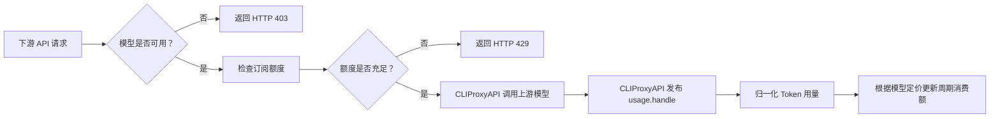

<div align="center">
  <h1>cpa-plugin-key-billing</h1>
  <p><strong><a href="https://github.com/router-for-me/CLIProxyAPI">CLIProxyAPI</a> 下游 API Key 计费与订阅额度插件。</strong></p>
  <p>
    <a href="https://github.com/haowang02/cpa-plugin-key-billing/releases/latest"></a>
    <a href="https://github.com/haowang02/cpa-plugin-key-billing/actions/workflows/check.yml"></a>
    
    <a href="./LICENSE"></a>
  </p>
</div>

<table>
  <tr>
    <td width="50%"></td>
    <td width="50%"></td>
  </tr>
  <tr>
    <td width="50%"></td>
    <td width="50%"></td>
  </tr>
</table>

## 功能特性

- 支持定期重置额度，每个 API Key 独立计时
- 支持按输入 Token 阈值切换长上下文**阶梯计价**
- 支持限制每个 API Key **可用的模型**，可直接选择模型，也可复用模型分组
- 可从 [models.dev](https://models.dev/) 获取模型参考价，不用挨个设置模型定价

## 工作原理

插件在请求进入时检查模型权限和订阅额度。上游调用结束后，CLIProxyAPI 通过 `usage.handle` 提供用量；插件据此计算费用并更新 API Key 的累计用量和周期消费额。插件不解析上游响应。



## 环境要求

- CLIProxyAPI `7.2.143` 或更高版本，建议使用最新版本
- 使用支持插件的 CLIProxyAPI 构建，不要使用 no-plugin 版本

## 安装

在 CLIProxyAPI 根目录运行：

```sh
curl -LsSf https://raw.githubusercontent.com/haowang02/cpa-plugin-key-billing/main/install.sh | sh
```

安装脚本会识别操作系统和处理器架构，并将插件安装到 `plugins/` 目录。安装完成后需要重启 CLIProxyAPI。

也可以从 [Releases](../../releases/latest) 下载对应平台的发布包，解压后将动态库放入 CLIProxyAPI 的 `plugins/` 目录：

```text
plugins/cpa-key-billing.so       # Linux
plugins/cpa-key-billing.dylib    # macOS（二选一）
```

## 配置

在 CLIProxyAPI 配置文件中加入：

```yaml
plugins:
  enabled: true
  dir: "plugins"
  configs:
    cpa-key-billing:
      enabled: true
      state_file: "plugins/cpa-key-billing-state.db"
```

- `enabled`：启用计费和订阅额度控制
- `state_file`：计费数据库文件路径

插件使用 SQLite 持久化配置、累计用量和日志。已有 JSON 状态文件会在首次启动时导入同名 `.db`，已有 SQLite 数据库会自动升级到当前格式。

重启 CLIProxyAPI 后，在管理中心打开「API Key 计费」。确认模型定价后，创建订阅计划并绑定需要限制的 API Key。

## 计费与订阅规则

- 未绑定订阅计划的 API Key 只统计用量，不限制额度。
- 未定价模型按 `0 USD` 记录，并在计费日志中标记。
- 失败且 token 全为零的 usage 不计费；失败事件携带实际用量时仍按用量计费。
- 每个实际生成用量的事件独立计费，重试和附加模型调用分别计算。
- 无法可靠拆分的 token 用量会标记为不可计费，不估算金额。
- 计费日志记录 API Key、计费模型、脱敏凭据来源、Token、TPS、延迟、费用和执行状态。
- 计费日志和插件日志都保存在计费数据库中，重启后仍然可读，均保留最近 30 天，不限制条目数量。
- 每个 API Key 在首次使用时独立启动周期。周期到期后回到未开始状态，并在下一次使用时开启新周期。
- 达到订阅额度后，后续请求返回 HTTP `429`，并在插件日志中记录一次；同一周期内的后续拦截不再重复记录。

## 拦截请求的响应

被拦截的请求按 CLIProxyAPI 自身的错误格式返回，客户端 SDK 无需区分是代理还是插件拒绝了请求：

| 场景 | 状态码 | `type` | `code` |
| --- | --- | --- | --- |
| 订阅额度用尽 | `429` | `rate_limit_error` | `rate_limit_exceeded` |
| 模型无权访问 | `403` | `permission_error` | `insufficient_quota` |

Anthropic 格式的客户端收到 `{"type":"error","error":{...}}`，其余格式（含 Gemini）收到 `{"error":{...}}`，其中 `message` 说明具体原因：额度用尽会写明本期消费、额度和重置时间，模型拦截会写明被拒模型和该 Key 可用的模型。

额度用尽时会带上 `Retry-After`，值为距本期重置的秒数，最多 1 小时；不自动重置的计划不带该头。模型拦截不带 `Retry-After`——重试无用，只能由管理员调整。

流式请求同样直接返回上表中的状态码和响应体，请求不会到达上游。

## 致谢

- [LINUX DO](https://linux.do/)——面向创造者与好奇者的社区
