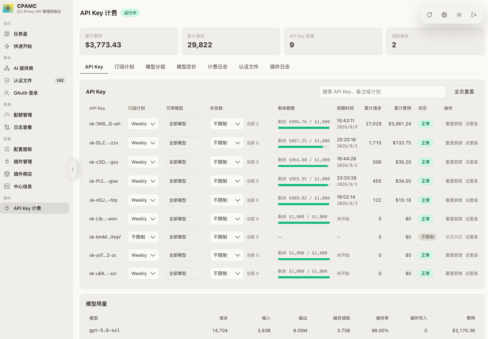
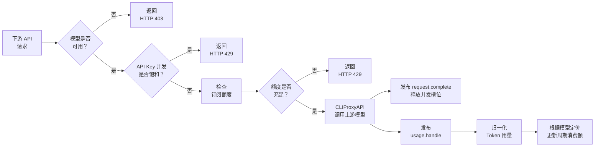

<div align="center">
  <h1>cpa-plugin-key-billing</h1>
  <p><strong><a href="https://github.com/router-for-me/CLIProxyAPI">CLIProxyAPI</a> 下游 API Key 计费与订阅额度插件。</strong></p>
  <p>
    <a href="https://github.com/haowang02/cpa-plugin-key-billing/releases/latest"></a>
    <a href="https://github.com/haowang02/cpa-plugin-key-billing/actions/workflows/check.yml"></a>
    
    <a href="./LICENSE"></a>
  </p>
</div>



## 功能特性

- 支持定期重置额度，每个 API Key 独立计时
- 支持按输入 Token 阈值切换长上下文**阶梯计价**
- 支持按 API Key 设置**最大并发请求数**，`0` 表示不限制，并显示当前并发
- 支持限制每个 API Key **可用的模型**，可直接选择模型，也可复用模型分组
- 可从 [models.dev](https://models.dev/) 获取模型参考价，不用挨个设置模型定价

## 工作原理

插件会在请求到达上游前检查模型权限、API Key 最大并发请求数和订阅额度。通过检查的生成请求占用一个并发槽位，并在请求结束后释放。非流式和流式请求遵循相同规则。上游调用结束后，CLIProxyAPI 通过 `usage.handle` 提供用量。插件据此计算费用，并更新 API Key 的累计用量和周期消费额，不复制或解析上游响应。



## 环境要求

- CLIProxyAPI `7.2.143` 或更高版本，建议使用最新版本
- 使用支持插件的 CLIProxyAPI 构建，不要使用 no-plugin 版本

## 安装

在 CLIProxyAPI 根目录运行。macOS 和 Linux 使用：

```sh
curl -LsSf https://raw.githubusercontent.com/haowang02/cpa-plugin-key-billing/main/install.sh | sh
```

Windows 请先停止 CLIProxyAPI，再在 PowerShell 中运行：

```powershell
irm https://raw.githubusercontent.com/haowang02/cpa-plugin-key-billing/main/install.ps1 | iex
```

安装脚本会识别 amd64 或 arm64 架构、校验下载文件的 SHA-256，并将插件安装到当前目录的 `plugins/`。安装或升级完成后需要重启 CLIProxyAPI。

也可以从 [Releases](../../releases/latest) 下载对应平台的发布包，解压后将动态库放入 CLIProxyAPI 的 `plugins/` 目录：

```text
plugins/cpa-key-billing.so       # Linux
plugins/cpa-key-billing.dylib    # macOS
plugins/cpa-key-billing.dll      # Windows
```

## 配置

在 CLIProxyAPI 配置文件中加入：

```yaml
plugins:
  enabled: true
  dir: "plugins"
  configs:
    cpa-key-billing:
      enabled: true
      state_file: "plugins/cpa-key-billing-state.db"
```

- `enabled`：启用计费、并发限制和订阅额度控制
- `state_file`：计费数据库文件路径

插件使用 SQLite 持久化配置、累计用量和日志。已有 JSON 状态文件会在首次启动时导入同名 `.db`，已有 SQLite 数据库会自动升级到当前格式。

重启 CLIProxyAPI 后，在管理中心打开「API Key 计费」。确认模型定价后，创建订阅计划并绑定需要限制的 API Key。

## 页面访问

管理员可以从 CLIProxyAPI 管理中心的「API Key 计费」菜单进入，也可以直接打开：

```text
http(s)://<CLIProxyAPI 地址>/v0/resource/plugins/cpa-key-billing/ui
```

普通用户使用自己的 API Key 查询订阅额度和用量时，直接打开：

```text
http(s)://<CLIProxyAPI 地址>/v0/resource/plugins/cpa-key-billing/ui#account
```

## 计费与订阅规则

- 未绑定订阅计划的 API Key 只统计用量，不限制额度。每个 API Key 独立计算订阅周期。
- 未定价模型按 `0 USD` 记录。
- 失败且 Token 为零的请求不计费；产生实际用量的失败、重试和附加调用分别计费。
- 计费日志和插件日志持久化保存，并保留最近 30 天。
- 达到订阅额度后返回 HTTP `429`，同一周期只记录一次额度拦截事件。

## 拦截请求的响应

被拦截的请求按 CLIProxyAPI 自身的错误格式返回，客户端 SDK 无需区分是代理还是插件拒绝了请求：

| 场景 | 状态码 | `type` | `code` |
| --- | --- | --- | --- |
| API Key 并发已满 | `429` | `rate_limit_error` | `rate_limit_exceeded` |
| 订阅额度用尽 | `429` | `rate_limit_error` | `rate_limit_exceeded` |
| 模型无权访问 | `403` | `permission_error` | `insufficient_quota` |

Anthropic 格式的客户端收到 `{"type":"error","error":{...}}`，其他格式的客户端（包括 Gemini）收到 `{"error":{...}}`。其中，`message` 会说明具体原因。额度用尽时会写明本期消费、额度和重置时间；模型被拦截时会写明被拒模型和该 Key 可用的模型。

并发已满时，响应包含 `Retry-After: 1`。额度用尽时，`Retry-After` 表示距离本期重置的秒数，最大为 1 小时。不自动重置的计划不会返回该响应头。模型拦截也不会返回该响应头，因为重试无法解决权限问题，需要管理员调整配置。

流式请求同样直接返回上表中的状态码和响应体，被拦截的请求不会到达上游。

## 致谢

- [LINUX DO](https://linux.do/) - 新的理想型社区
