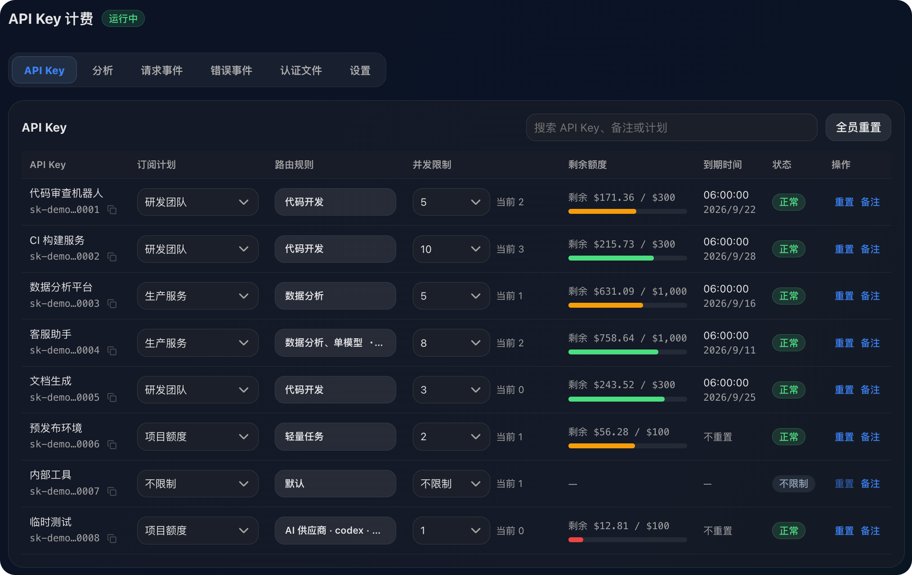
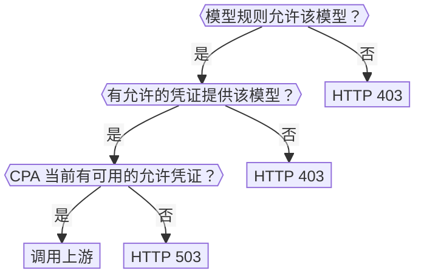

<div align="center">
  <h1>CPA Key Billing</h1>
  <p><strong><a href="https://github.com/router-for-me/CLIProxyAPI">CLIProxyAPI</a> 下游 API Key 计费、额度与路由管理插件。</strong></p>
  <p>
    <a href="https://github.com/haowang02/cpa-plugin-key-billing/releases/latest"></a>
    <a href="https://github.com/haowang02/cpa-plugin-key-billing/releases"></a>
    
    <a href="./LICENSE"></a>
  </p>
  <p><a href="./README.en.md">English</a> · <strong>简体中文</strong></p>
</div>


## 功能特性

- 按 API Key 限制金额、Token、请求次数和并发，支持多个 Key 共享额度
- 支持美元、人民币定价和长上下文阶梯价格，可使用 [models.dev](https://models.dev/) 参考价
- 通过路由规则控制可用模型和上游凭证
- 提供管理页面与 API Key 自助查询，保留各 Key 的独立用量统计

## 安装

需要支持插件的 CLIProxyAPI **8.0.44 或更高版本**。

在 CPAMC 或 CPAMP 插件商店搜索 `cpa-key-billing`，或在 CPA 根目录运行脚本装到 `plugins/`。

macOS / Linux：

```sh
curl -LsSf https://raw.githubusercontent.com/haowang02/cpa-plugin-key-billing/main/install.sh | sh
```

Windows：先停止 CLIProxyAPI，再在 PowerShell 中运行：

```powershell
irm https://raw.githubusercontent.com/haowang02/cpa-plugin-key-billing/main/install.ps1 | iex
```

## 配置

在 CLIProxyAPI 配置文件中加入：

```yaml
plugins:
  enabled: true
  dir: "plugins"
  configs:
    cpa-key-billing:
      enabled: true
      priority: 100                      # 调度优先级，数值越大越优先
      debug: false                       # 记录调试日志

      # 数据
      state_file: "plugins/cpa-key-billing-state-v1.db"
      request_event_retention_days: 365  # 历史保留天数，缩短会删除超期数据

      # 计费
      allow_unpriced_models: false       # 允许未定价模型，以零费用记录用量
      codex_fast_mode_billing: false     # 以 priority 档位发往上游的 Codex 请求按 2.5 倍计费
      cny_per_usd: 7                     # 1 美元兑换的人民币数

      # API Key 查询页
      mask_api_key_view_emails: false    # 隐藏完整邮箱
      allow_api_key_quota_reset: false   # 允许用户重置可访问的 Codex / Claude 认证文件额度

      # 凭证调度，只作用于限制了上游凭证的请求
      routing:
        strategy: "round-robin"          # round-robin、weighted-round-robin、fill-first
        session-affinity: false          # 同一会话优先复用可用凭证
        session-affinity-ttl: "1h"       # 会话绑定的空闲过期时间
```

安装或升级后重启 CLIProxyAPI。

> [!WARNING]
> 升级前备份 `state_file`。从 v0.8.4 或更早版本升级须改用新数据文件。

## 页面访问

可从管理面板进入，也可直接访问：

```text
http(s)://<CLIProxyAPI 地址>/v0/resource/plugins/cpa-key-billing/ui
```

## 计费与额度

### 模型价格

自定义价优先于参考价，默认拒绝未定价模型。额度按计划币种扣减，汇率取 `cny_per_usd`。

### 订阅计划

每个计划可设置多个周期窗口，组合限制金额、Token 和请求次数。

| 类型 | 额度归属 | 周期重置 |
| --- | --- | --- |
| 独立周期 | 每个 Key 独享 | 从各自首次放行请求开始计时 |
| 统一周期 | 每个 Key 独享 | 按计划指定时间统一重置 |
| 共享额度 | 所有绑定 Key 共用 | 按计划指定时间统一重置 |

清理历史记录不重置额度；共享池不会因成员 Key 解绑或删除而退回已用额度。

## 路由规则

路由规则限制 API Key 可用的模型和上游凭证。凭证可逐个或按类选择，如「认证文件 · codex」。

同一 Key 的模型和凭证规则分别合并生效。白名单取并集，为空时不限，黑名单优先。


```mermaid
---
config:
  htmlLabels: false
  themeVariables:
    fontSize: "13px"
  flowchart:
    diagramPadding: 4
    nodeSpacing: 20
    rankSpacing: 28
    padding: 3
    wrappingWidth: 240
---
flowchart TB
    D{{模型规则允许该模型？}} -- 是 --> E{{有允许的凭证提供该模型？}}
    E -- 是 --> P{{CPA 当前有可用的允许凭证？}}
    P -- 是 --> U[调用上游]
    D -- 否 --> R1[HTTP 403]
    E -- 否 --> R2[HTTP 403]
    P -- 否 --> S[HTTP 503]
```

- 禁用的凭证不提供任何模型；冷却中的凭证仍视为提供，此时返回 503。
- `/v1/models` 只列出该 Key 能调用的模型，CPAMC 和 CPAMP 管理面板仍显示完整列表。
- 凭证规则仅限本实例加载的凭证。CPA Home 下发的凭证不可见，故拒绝带凭证规则的 Key。

## 请求被拒绝时

| 状态码 | 检查项 |
| --- | --- |
| `403` | Key 的路由规则是否允许该模型，允许的上游凭证是否提供该模型 |
| `429` | 订阅额度是否耗尽，或并发是否已满 |
| `503` | 模型是否已定价、允许的上游凭证是否可用；具体原因见插件日志 |

## 致谢

- [LINUX DO](https://linux.do/) — 新的理想型社区
